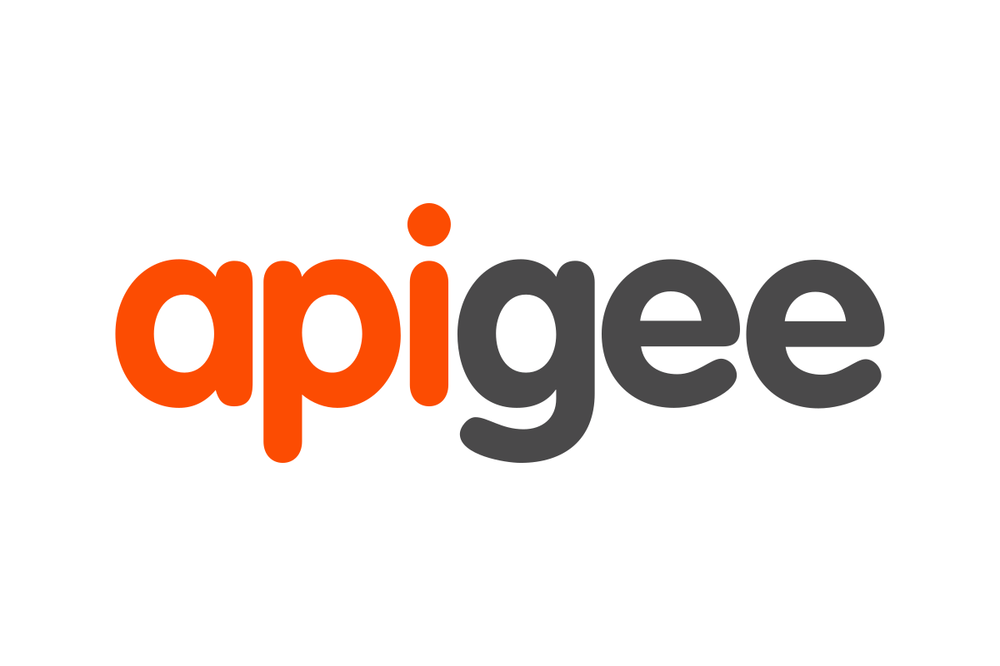
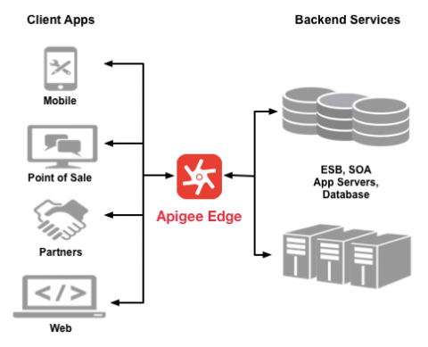

<div id="top"></div>


<!-- PROJECT LOGO -->
<br />
<div align="center">
  <a>
    
  </a>

  <div style="text-align: right"><h3 align="center">API Management using APIGEE & GCP</h3></div>

</div>


<!-- TABLE OF CONTENTS -->
<details>
  <summary>Table of Contents</summary>
  <ol>
    <li>
      <a href="#about-the-project">About The Project</a>
      <ul>
        <li><a href="#built-with">Built With</a></li>
      </ul>
    </li>
    <li>
      <a href="#getting-started">Getting Started</a>
      <ul>
        <li><a href="#prerequisites">Prerequisites</a></li>
        <li><a href="#installation">Installation</a></li>
      </ul>
    </li>
    <li><a href="#usage">Usage</a></li>
    <li><a href="#references">References</a></li>
    <li><a href="#contact">Contact</a></li>
  </ol>
</details>


<!-- ABOUT THE PROJECT -->
## About The Project

Monolithic architectures are passing out of vogue these days and are increasingly being replaced by more modular service-oriented architectures with specific APIs for different purposes. I built, deployed and fine-tuned API proxies to enforce policies and regulate access to our APIs on the Google Cloud Platform. I implemented the powerful features and often underestimated advantages of using a fully-fledged API management platform like Apigee where you can create policies to administer quotas, authorize users, charge for the usage of your APIs, enforce limits on usage and protect against security threats. And then I discovered how to create, deploy and undeploy API proxies using Apigee Edge. Then, I took advantae of Preflows, Postflows, and ConditionalFlows, which are ways to specify logic that the Apigee Edge Proxy will enforce. Finally, I explored how to integrate Apigee with Google App Engine. 

### Topics I implemented:
* Attaching Policies to the API Proxy
* Attaching Spike Arrest and Quota Policies
* Configuring Response Cache Policies
* Creating Conditional Flows and Access Control Policies
* Writing Procedural Code to Process Requests
* Implementing a Simple Node.js Application
* Securing Access Using API Keys
* Configuring an API Proxy Secured Using OAuth
* Generating an Access Token and Accessing the API
* Performance Analytics for API Proxies


<p align="right">(<a href="#top">back to top</a>)</p>


### Built With

The tools that have been used in the project are mentioned below:

* [Google Cloud Platform](https://cloud.google.com/)
* [APIGEE Edge](https://apigee.google.com/edge)

<p align="right">(<a href="#top">back to top</a>)</p>


<!-- GETTING STARTED -->
## Getting Started

### Introduction
- __API__ : A way for one application to invoke code or consume data from another application.
- __Apigee__ : A company that built a full lifecycle API management platform acquired by Google in 2016.
- __Apigee Edge__ : The API management platform built by Apigee, which allows developers to build and manage API proxies.
- __API Proxy__ : A program that sits in front of your API and proxy incoming user requests to the API and provides various value-added features.

<br><center>  </center><br>


### Prerequisites

1. Create an account in Google Cloud Platform and APIGEE Edge

### Installation


1. Download Node JS
2. Install NPM packages
   ```sh
   npm install
   ```

<p align="right">(<a href="#top">back to top</a>)</p>


<!-- USAGE EXAMPLES -->
## Usage

> ### Spike Management
* Dynamic routing
* Caching
* Rate-limits

> ### Monetization
* Flexible rate plans
* Usage tracking and API keys
* Tiered access
* Varying rate limits and pricing

> ### Performance Management
* Track active developers and apps
* Response time and latency
* Error rates
* Revenue metrics


<p align="right">(<a href="#top">back to top</a>)</p>


<!-- Regerences -->
## References
> - [https://pluralsight.com/library/courses/google-apigee-api-management-streamlining/](https://pluralsight.com/library/courses/google-apigee-api-management-streamlining/)
> - [https://docs.apigee.com/](https://docs.apigee.com/)

<p align="right">(<a href="#top">back to top</a>)</p>


<!-- CONTACT -->
## Contact
<br/>

> ### <center> __*Yaseen Shaik*__ </center>
>
> - Email ID  - yaseenshaik00@gmail.com
> - Linkedin  - [www.linkedin.com/in/yaseenshaik00](www.linkedin.com/in/yaseenshaik00)
> - Twitter   - [https://twitter.com/yaseenshaik00](https://twitter.com/yaseenshaik00)
> - Github    - [https://github.com/yaseenshaik00](https://github.com/yaseenshaik00)
>  


<p align="right">(<a href="#top">back to top</a>)</p>
